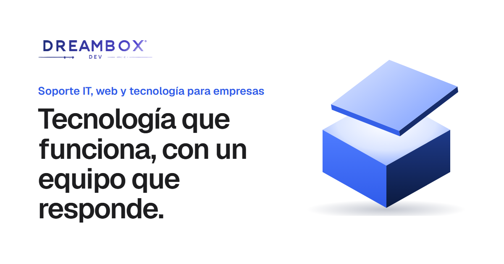

  

<h1 align="center">DreamBox</h1>

  <strong>Soporte IT, sitios web y tecnología para empresas en México.</strong> 
  Somos el equipo de sistemas de tu empresa: resolvemos, mantenemos y mejoramos tu tecnología.

  <a href="https://dreamboxdev.netlify.app"><strong>Visitar el sitio →</strong></a>
  &nbsp;·&nbsp;
  <a href="https://wa.me/525659239380"><strong>Escríbenos por WhatsApp</strong></a>

---

## Qué hacemos

| | |
|---|---|
| **Soporte técnico y mesa de ayuda** | Resolvemos los problemas con tus programas, cuentas y sistemas por WhatsApp, correo o acceso remoto. |
| **Sitios web y tiendas en línea** | Creamos, migramos y mantenemos tu web para que cargue rápido, aparezca en Google y reciba clientes. |
| **Mantenimiento mensual** | Actualizaciones, copias de seguridad y monitoreo para que tus sistemas no fallen en el peor momento. |
| **Automatización e IA** | Automatizamos tareas repetitivas: cotizaciones, reportes, respuestas y recordatorios. |
| **Nube, correo y seguridad** | Correo corporativo, almacenamiento en la nube, accesos y respaldos configurados de forma segura. |
| **Sistemas a la medida** | Cuando una herramienta estándar no alcanza, desarrollamos la que necesitas y la mantenemos contigo. |

## Cómo trabajamos

- **Respuesta el mismo día** en horario laboral.
- **Precio fijo mensual**, sin cobros sorpresa.
- **Una persona responsable** que conoce tu empresa y tus sistemas.
- **Mes a mes**, sin contratos largos. Te quedas porque funciona.

## Hablemos

¿Tu empresa necesita que la tecnología simplemente funcione?

- 💬 **WhatsApp:** [+52 56 5923 9380](https://wa.me/525659239380)
- 🌐 **Sitio web:** [dreamboxdev.netlify.app](https://dreamboxdev.netlify.app), con formulario de contacto

---

  Sitio diseñado y desarrollado por Santiago Ortega · © DreamBox Dev. Todos los derechos reservados.

